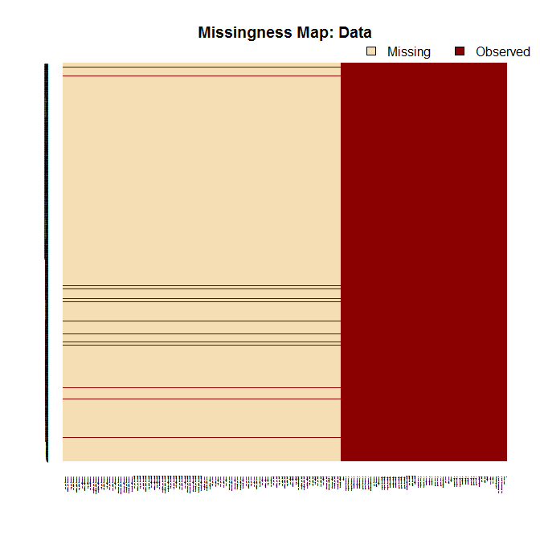
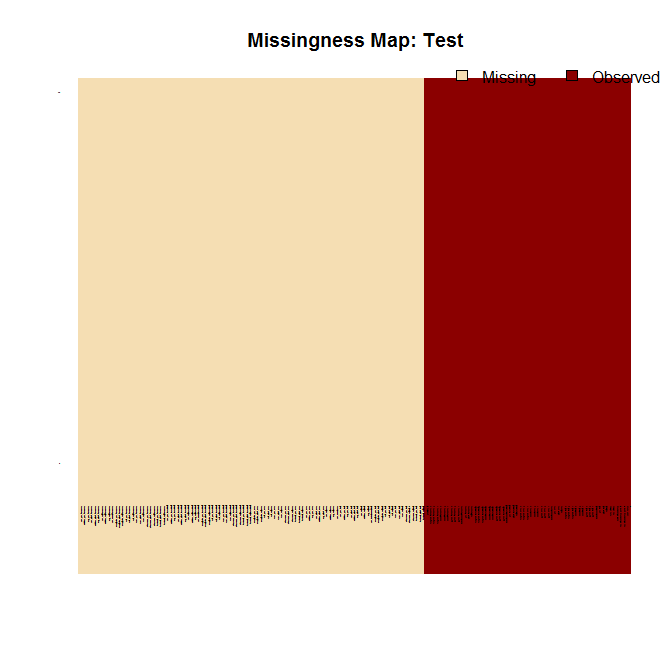
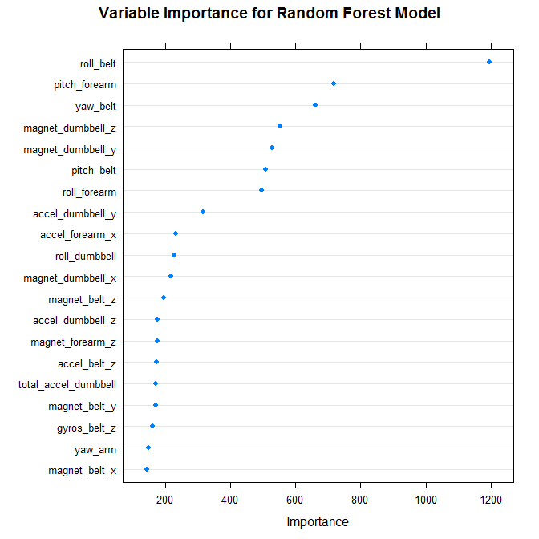

# Mistake detection in a weight-lifting exercise using a random forest analysis of data obtained from an on-body sensing system


This markdown file was generated on Fri Sep 12 3:14:16 PM 2014 UTC using R version 3.1.1 (2014-07-10).

## Introduction

This assignment was completed to fulfill, in part, the requirements of the [Johns Hopkins University Practical Machine Learning](https://www.coursera.org/course/predmachlearn) course.  The purpose of this assignment was to demonstrate competency in applying and interpreting basic machine learning algorithms to complex data sets.

To do this, I analyzed the [Weight Lifting Exercises Dataset](http://groupware.les.inf.puc-rio.br/har) developed by [Groupware@LES](http://groupware.les.inf.puc-rio.br/) [@ah13_velloso].  The data was derived, briefly, as follows.  Six young healthy male participants, aged 20-28 years, were asked to perform one set of 10 repetitions of a unilateral dumbbell bicep curl exercise in five different manners: 

* exactly according to the specification (Class A) 
* throwing the elbows to the front (Class B)
* lifting the dumbbell only halfway (Class C) 
* lowering the dumbbell only halfway (Class D) 
* throwing the hips to the front (Class E)  

Thus, class A corresponded to the specified execution of the exercise, while the other four classes corresponded to common mistakes. An on-body sensing system, consisting of multiple wearable devices, gathered information concerning joint angle, range, and repetition count for the wrist, elbow, and shoulder.

In the current analysis, I attempted to apply machine learning algorithms to data obtained from the on-body sensing system as a means to detect mistakes.  

## Set parameters, load in and preprocess the data


```r
setwd("C:/Users/Carl/SkyDrive/Documents")
Sys.setlocale("LC_TIME", "English")
set.seed(66669)
suppressPackageStartupMessages(require("Amelia"))
suppressPackageStartupMessages(require("caret"))
suppressPackageStartupMessages(require("doParallel"))
options(scipen = 1, digits = 7)
cl<-makeCluster(3)
registerDoParallel(cl)
fileUrl1 <- "https://d396qusza40orc.cloudfront.net/predmachlearn/pml-training.csv"
fileUrl2 <- "https://d396qusza40orc.cloudfront.net/predmachlearn/pml-testing.csv"
if(!file.exists("pml-testing.csv")){
        download.file(fileUrl1, destfile = "pml-testing.csv", 
                      method="auto") 
}
if(!file.exists("pml-training.csv")){
        download.file(fileUrl2, destfile = "pml-training.csv", 
                      method="auto")          
}
testing <- read.csv("pml-testing.csv", na.strings = c("NA"," ",""))
data <- read.csv("pml-training.csv", na.strings = c("NA"," ",""))
```

First, a brief look at the data set at hand:


```r
str(data)
```

```
## 'data.frame':	19622 obs. of  160 variables:
##  $ X                       : int  1 2 3 4 5 6 7 8 9 10 ...
##  $ user_name               : Factor w/ 6 levels "adelmo","carlitos",..: 2 2 2 2 2 2 2 2 2 2 ...
##  $ raw_timestamp_part_1    : int  1323084231 1323084231 1323084231 1323084232 1323084232 1323084232 1323084232 1323084232 1323084232 1323084232 ...
##  $ raw_timestamp_part_2    : int  788290 808298 820366 120339 196328 304277 368296 440390 484323 484434 ...
##  $ cvtd_timestamp          : Factor w/ 20 levels "02/12/2011 13:32",..: 9 9 9 9 9 9 9 9 9 9 ...
##  $ new_window              : Factor w/ 2 levels "no","yes": 1 1 1 1 1 1 1 1 1 1 ...
##  $ num_window              : int  11 11 11 12 12 12 12 12 12 12 ...
##  $ roll_belt               : num  1.41 1.41 1.42 1.48 1.48 1.45 1.42 1.42 1.43 1.45 ...
##  $ pitch_belt              : num  8.07 8.07 8.07 8.05 8.07 8.06 8.09 8.13 8.16 8.17 ...
##  $ yaw_belt                : num  -94.4 -94.4 -94.4 -94.4 -94.4 -94.4 -94.4 -94.4 -94.4 -94.4 ...
##  $ total_accel_belt        : int  3 3 3 3 3 3 3 3 3 3 ...
##  $ kurtosis_roll_belt      : Factor w/ 396 levels "-0.016850","-0.021024",..: NA NA NA NA NA NA NA NA NA NA ...
##  $ kurtosis_picth_belt     : Factor w/ 316 levels "-0.021887","-0.060755",..: NA NA NA NA NA NA NA NA NA NA ...
##  $ kurtosis_yaw_belt       : Factor w/ 1 level "#DIV/0!": NA NA NA NA NA NA NA NA NA NA ...
##  $ skewness_roll_belt      : Factor w/ 394 levels "-0.003095","-0.010002",..: NA NA NA NA NA NA NA NA NA NA ...
##  $ skewness_roll_belt.1    : Factor w/ 337 levels "-0.005928","-0.005960",..: NA NA NA NA NA NA NA NA NA NA ...
##  $ skewness_yaw_belt       : Factor w/ 1 level "#DIV/0!": NA NA NA NA NA NA NA NA NA NA ...
##  $ max_roll_belt           : num  NA NA NA NA NA NA NA NA NA NA ...
##  $ max_picth_belt          : int  NA NA NA NA NA NA NA NA NA NA ...
##  $ max_yaw_belt            : Factor w/ 67 levels "-0.1","-0.2",..: NA NA NA NA NA NA NA NA NA NA ...
##  $ min_roll_belt           : num  NA NA NA NA NA NA NA NA NA NA ...
##  $ min_pitch_belt          : int  NA NA NA NA NA NA NA NA NA NA ...
##  $ min_yaw_belt            : Factor w/ 67 levels "-0.1","-0.2",..: NA NA NA NA NA NA NA NA NA NA ...
##  $ amplitude_roll_belt     : num  NA NA NA NA NA NA NA NA NA NA ...
##  $ amplitude_pitch_belt    : int  NA NA NA NA NA NA NA NA NA NA ...
##  $ amplitude_yaw_belt      : Factor w/ 3 levels "#DIV/0!","0.00",..: NA NA NA NA NA NA NA NA NA NA ...
##  $ var_total_accel_belt    : num  NA NA NA NA NA NA NA NA NA NA ...
##  $ avg_roll_belt           : num  NA NA NA NA NA NA NA NA NA NA ...
##  $ stddev_roll_belt        : num  NA NA NA NA NA NA NA NA NA NA ...
##  $ var_roll_belt           : num  NA NA NA NA NA NA NA NA NA NA ...
##  $ avg_pitch_belt          : num  NA NA NA NA NA NA NA NA NA NA ...
##  $ stddev_pitch_belt       : num  NA NA NA NA NA NA NA NA NA NA ...
##  $ var_pitch_belt          : num  NA NA NA NA NA NA NA NA NA NA ...
##  $ avg_yaw_belt            : num  NA NA NA NA NA NA NA NA NA NA ...
##  $ stddev_yaw_belt         : num  NA NA NA NA NA NA NA NA NA NA ...
##  $ var_yaw_belt            : num  NA NA NA NA NA NA NA NA NA NA ...
##  $ gyros_belt_x            : num  0 0.02 0 0.02 0.02 0.02 0.02 0.02 0.02 0.03 ...
##  $ gyros_belt_y            : num  0 0 0 0 0.02 0 0 0 0 0 ...
##  $ gyros_belt_z            : num  -0.02 -0.02 -0.02 -0.03 -0.02 -0.02 -0.02 -0.02 -0.02 0 ...
##  $ accel_belt_x            : int  -21 -22 -20 -22 -21 -21 -22 -22 -20 -21 ...
##  $ accel_belt_y            : int  4 4 5 3 2 4 3 4 2 4 ...
##  $ accel_belt_z            : int  22 22 23 21 24 21 21 21 24 22 ...
##  $ magnet_belt_x           : int  -3 -7 -2 -6 -6 0 -4 -2 1 -3 ...
##  $ magnet_belt_y           : int  599 608 600 604 600 603 599 603 602 609 ...
##  $ magnet_belt_z           : int  -313 -311 -305 -310 -302 -312 -311 -313 -312 -308 ...
##  $ roll_arm                : num  -128 -128 -128 -128 -128 -128 -128 -128 -128 -128 ...
##  $ pitch_arm               : num  22.5 22.5 22.5 22.1 22.1 22 21.9 21.8 21.7 21.6 ...
##  $ yaw_arm                 : num  -161 -161 -161 -161 -161 -161 -161 -161 -161 -161 ...
##  $ total_accel_arm         : int  34 34 34 34 34 34 34 34 34 34 ...
##  $ var_accel_arm           : num  NA NA NA NA NA NA NA NA NA NA ...
##  $ avg_roll_arm            : num  NA NA NA NA NA NA NA NA NA NA ...
##  $ stddev_roll_arm         : num  NA NA NA NA NA NA NA NA NA NA ...
##  $ var_roll_arm            : num  NA NA NA NA NA NA NA NA NA NA ...
##  $ avg_pitch_arm           : num  NA NA NA NA NA NA NA NA NA NA ...
##  $ stddev_pitch_arm        : num  NA NA NA NA NA NA NA NA NA NA ...
##  $ var_pitch_arm           : num  NA NA NA NA NA NA NA NA NA NA ...
##  $ avg_yaw_arm             : num  NA NA NA NA NA NA NA NA NA NA ...
##  $ stddev_yaw_arm          : num  NA NA NA NA NA NA NA NA NA NA ...
##  $ var_yaw_arm             : num  NA NA NA NA NA NA NA NA NA NA ...
##  $ gyros_arm_x             : num  0 0.02 0.02 0.02 0 0.02 0 0.02 0.02 0.02 ...
##  $ gyros_arm_y             : num  0 -0.02 -0.02 -0.03 -0.03 -0.03 -0.03 -0.02 -0.03 -0.03 ...
##  $ gyros_arm_z             : num  -0.02 -0.02 -0.02 0.02 0 0 0 0 -0.02 -0.02 ...
##  $ accel_arm_x             : int  -288 -290 -289 -289 -289 -289 -289 -289 -288 -288 ...
##  $ accel_arm_y             : int  109 110 110 111 111 111 111 111 109 110 ...
##  $ accel_arm_z             : int  -123 -125 -126 -123 -123 -122 -125 -124 -122 -124 ...
##  $ magnet_arm_x            : int  -368 -369 -368 -372 -374 -369 -373 -372 -369 -376 ...
##  $ magnet_arm_y            : int  337 337 344 344 337 342 336 338 341 334 ...
##  $ magnet_arm_z            : int  516 513 513 512 506 513 509 510 518 516 ...
##  $ kurtosis_roll_arm       : Factor w/ 329 levels "-0.02438","-0.04190",..: NA NA NA NA NA NA NA NA NA NA ...
##  $ kurtosis_picth_arm      : Factor w/ 327 levels "-0.00484","-0.01311",..: NA NA NA NA NA NA NA NA NA NA ...
##  $ kurtosis_yaw_arm        : Factor w/ 394 levels "-0.01548","-0.01749",..: NA NA NA NA NA NA NA NA NA NA ...
##  $ skewness_roll_arm       : Factor w/ 330 levels "-0.00051","-0.00696",..: NA NA NA NA NA NA NA NA NA NA ...
##  $ skewness_pitch_arm      : Factor w/ 327 levels "-0.00184","-0.01185",..: NA NA NA NA NA NA NA NA NA NA ...
##  $ skewness_yaw_arm        : Factor w/ 394 levels "-0.00311","-0.00562",..: NA NA NA NA NA NA NA NA NA NA ...
##  $ max_roll_arm            : num  NA NA NA NA NA NA NA NA NA NA ...
##  $ max_picth_arm           : num  NA NA NA NA NA NA NA NA NA NA ...
##  $ max_yaw_arm             : int  NA NA NA NA NA NA NA NA NA NA ...
##  $ min_roll_arm            : num  NA NA NA NA NA NA NA NA NA NA ...
##  $ min_pitch_arm           : num  NA NA NA NA NA NA NA NA NA NA ...
##  $ min_yaw_arm             : int  NA NA NA NA NA NA NA NA NA NA ...
##  $ amplitude_roll_arm      : num  NA NA NA NA NA NA NA NA NA NA ...
##  $ amplitude_pitch_arm     : num  NA NA NA NA NA NA NA NA NA NA ...
##  $ amplitude_yaw_arm       : int  NA NA NA NA NA NA NA NA NA NA ...
##  $ roll_dumbbell           : num  13.1 13.1 12.9 13.4 13.4 ...
##  $ pitch_dumbbell          : num  -70.5 -70.6 -70.3 -70.4 -70.4 ...
##  $ yaw_dumbbell            : num  -84.9 -84.7 -85.1 -84.9 -84.9 ...
##  $ kurtosis_roll_dumbbell  : Factor w/ 397 levels "-0.0035","-0.0073",..: NA NA NA NA NA NA NA NA NA NA ...
##  $ kurtosis_picth_dumbbell : Factor w/ 400 levels "-0.0163","-0.0233",..: NA NA NA NA NA NA NA NA NA NA ...
##  $ kurtosis_yaw_dumbbell   : Factor w/ 1 level "#DIV/0!": NA NA NA NA NA NA NA NA NA NA ...
##  $ skewness_roll_dumbbell  : Factor w/ 400 levels "-0.0082","-0.0096",..: NA NA NA NA NA NA NA NA NA NA ...
##  $ skewness_pitch_dumbbell : Factor w/ 401 levels "-0.0053","-0.0084",..: NA NA NA NA NA NA NA NA NA NA ...
##  $ skewness_yaw_dumbbell   : Factor w/ 1 level "#DIV/0!": NA NA NA NA NA NA NA NA NA NA ...
##  $ max_roll_dumbbell       : num  NA NA NA NA NA NA NA NA NA NA ...
##  $ max_picth_dumbbell      : num  NA NA NA NA NA NA NA NA NA NA ...
##  $ max_yaw_dumbbell        : Factor w/ 72 levels "-0.1","-0.2",..: NA NA NA NA NA NA NA NA NA NA ...
##  $ min_roll_dumbbell       : num  NA NA NA NA NA NA NA NA NA NA ...
##  $ min_pitch_dumbbell      : num  NA NA NA NA NA NA NA NA NA NA ...
##  $ min_yaw_dumbbell        : Factor w/ 72 levels "-0.1","-0.2",..: NA NA NA NA NA NA NA NA NA NA ...
##  $ amplitude_roll_dumbbell : num  NA NA NA NA NA NA NA NA NA NA ...
##   [list output truncated]
```

```r
missmap(data, y.cex = 0.1, x.cex = 0.1, main = "Missingness Map: Data"); missmap(testing, y.cex = 0.1, x.cex = 0.1, main = "Missingness Map: Test")
```

  

The data set contained 19622 observations for 160 different variables.  Several columns, however, contained a large number of missing measurements (designated in the tan color in two charts seen above). Furthermore, the first seven columns contain irrelevant data (subject identifiers and timestamps; i.e. data that should not be related to the outcome).  As a result, all columns missing more than 50% of their respective measurements, as well as the first seven columns of irrelevant data, were removed from further analyses:


```r
n.test <- nrow(testing)  / 2
n.data <- nrow(data) / 2
testing <- testing[,colSums(is.na(testing)) < n.test]
data <- data[,colSums(is.na(data)) < n.data]
testing <- testing[ -c(1:7)]
data <- data[ -c(1:7)]
```


After removing incomplete or irrelevant data, the data set contained 19622 observations for 53 different variables.  I next tested the data set for the presence of predictors with near-zero variance:


```r
nearZeroVariables <- nearZeroVar(data[-53], saveMetrics=TRUE)
nearZeroVariables
```

```
##                      freqRatio percentUnique zeroVar   nzv
## roll_belt             1.101904     6.7781062   FALSE FALSE
## pitch_belt            1.036082     9.3772296   FALSE FALSE
## yaw_belt              1.058480     9.9734991   FALSE FALSE
## total_accel_belt      1.063160     0.1477933   FALSE FALSE
## gyros_belt_x          1.058651     0.7134849   FALSE FALSE
## gyros_belt_y          1.144000     0.3516461   FALSE FALSE
## gyros_belt_z          1.066214     0.8612782   FALSE FALSE
## accel_belt_x          1.055412     0.8357966   FALSE FALSE
## accel_belt_y          1.113725     0.7287738   FALSE FALSE
## accel_belt_z          1.078767     1.5237998   FALSE FALSE
## magnet_belt_x         1.090141     1.6664968   FALSE FALSE
## magnet_belt_y         1.099688     1.5187035   FALSE FALSE
## magnet_belt_z         1.006369     2.3290184   FALSE FALSE
## roll_arm             52.338462    13.5256345   FALSE FALSE
## pitch_arm            87.256410    15.7323412   FALSE FALSE
## yaw_arm              33.029126    14.6570176   FALSE FALSE
## total_accel_arm       1.024526     0.3363572   FALSE FALSE
## gyros_arm_x           1.015504     3.2769341   FALSE FALSE
## gyros_arm_y           1.454369     1.9162165   FALSE FALSE
## gyros_arm_z           1.110687     1.2638875   FALSE FALSE
## accel_arm_x           1.017341     3.9598410   FALSE FALSE
## accel_arm_y           1.140187     2.7367241   FALSE FALSE
## accel_arm_z           1.128000     4.0362858   FALSE FALSE
## magnet_arm_x          1.000000     6.8239731   FALSE FALSE
## magnet_arm_y          1.056818     4.4439914   FALSE FALSE
## magnet_arm_z          1.036364     6.4468454   FALSE FALSE
## roll_dumbbell         1.022388    84.2065029   FALSE FALSE
## pitch_dumbbell        2.277372    81.7449801   FALSE FALSE
## yaw_dumbbell          1.132231    83.4828254   FALSE FALSE
## total_accel_dumbbell  1.072634     0.2191418   FALSE FALSE
## gyros_dumbbell_x      1.003268     1.2282132   FALSE FALSE
## gyros_dumbbell_y      1.264957     1.4167771   FALSE FALSE
## gyros_dumbbell_z      1.060100     1.0498420   FALSE FALSE
## accel_dumbbell_x      1.018018     2.1659362   FALSE FALSE
## accel_dumbbell_y      1.053061     2.3748853   FALSE FALSE
## accel_dumbbell_z      1.133333     2.0894914   FALSE FALSE
## magnet_dumbbell_x     1.098266     5.7486495   FALSE FALSE
## magnet_dumbbell_y     1.197740     4.3012945   FALSE FALSE
## magnet_dumbbell_z     1.020833     3.4451126   FALSE FALSE
## roll_forearm         11.589286    11.0895933   FALSE FALSE
## pitch_forearm        65.983051    14.8557741   FALSE FALSE
## yaw_forearm          15.322835    10.1467740   FALSE FALSE
## total_accel_forearm   1.128928     0.3567424   FALSE FALSE
## gyros_forearm_x       1.059273     1.5187035   FALSE FALSE
## gyros_forearm_y       1.036554     3.7763735   FALSE FALSE
## gyros_forearm_z       1.122917     1.5645704   FALSE FALSE
## accel_forearm_x       1.126437     4.0464784   FALSE FALSE
## accel_forearm_y       1.059406     5.1116094   FALSE FALSE
## accel_forearm_z       1.006250     2.9558659   FALSE FALSE
## magnet_forearm_x      1.012346     7.7667924   FALSE FALSE
## magnet_forearm_y      1.246914     9.5403119   FALSE FALSE
## magnet_forearm_z      1.000000     8.5771073   FALSE FALSE
```


No near-zero variance predictors were observed.  After data clean up, the following 52 predictors remained:


```r
sort(names(data[-53]))
```

```
##  [1] "accel_arm_x"          "accel_arm_y"          "accel_arm_z"         
##  [4] "accel_belt_x"         "accel_belt_y"         "accel_belt_z"        
##  [7] "accel_dumbbell_x"     "accel_dumbbell_y"     "accel_dumbbell_z"    
## [10] "accel_forearm_x"      "accel_forearm_y"      "accel_forearm_z"     
## [13] "gyros_arm_x"          "gyros_arm_y"          "gyros_arm_z"         
## [16] "gyros_belt_x"         "gyros_belt_y"         "gyros_belt_z"        
## [19] "gyros_dumbbell_x"     "gyros_dumbbell_y"     "gyros_dumbbell_z"    
## [22] "gyros_forearm_x"      "gyros_forearm_y"      "gyros_forearm_z"     
## [25] "magnet_arm_x"         "magnet_arm_y"         "magnet_arm_z"        
## [28] "magnet_belt_x"        "magnet_belt_y"        "magnet_belt_z"       
## [31] "magnet_dumbbell_x"    "magnet_dumbbell_y"    "magnet_dumbbell_z"   
## [34] "magnet_forearm_x"     "magnet_forearm_y"     "magnet_forearm_z"    
## [37] "pitch_arm"            "pitch_belt"           "pitch_dumbbell"      
## [40] "pitch_forearm"        "roll_arm"             "roll_belt"           
## [43] "roll_dumbbell"        "roll_forearm"         "total_accel_arm"     
## [46] "total_accel_belt"     "total_accel_dumbbell" "total_accel_forearm" 
## [49] "yaw_arm"              "yaw_belt"             "yaw_dumbbell"        
## [52] "yaw_forearm"
```


Next, the resulting data were partitioned, using random selection, into a training set, consisting of 60% of the original data, and a cross-validation set, consisting of the remaining 40% of the original data:


```r
inTrain <- createDataPartition(data$classe, p=0.60, list=FALSE)
training <- data[inTrain,]
crossValidation <- data[-inTrain,]
```


## Fitting a random forest model

The `caret` package [@Kuhn:2008:JSSOBK:v28i05] was used to build predictive models in R.  A random forest model [@Breiman:2001:RF:570181.570182] was fitted using default parameters where the dependent variable was the class variable, and all 52 remaining variables were used as predictors.    


```r
model_rf <- train(classe~., method = "rf", data=training)
```

```
## Loading required package: randomForest
## randomForest 4.6-10
## Type rfNews() to see new features/changes/bug fixes.
```

```r
model_rf
```

```
## Random Forest 
## 
## 11776 samples
##    52 predictor
##     5 classes: 'A', 'B', 'C', 'D', 'E' 
## 
## No pre-processing
## Resampling: Bootstrapped (25 reps) 
## 
## Summary of sample sizes: 11776, 11776, 11776, 11776, 11776, 11776, ... 
## 
## Resampling results across tuning parameters:
## 
##   mtry  Accuracy  Kappa  Accuracy SD  Kappa SD
##    2    0.985     0.981  0.00167      0.00211 
##   27    0.986     0.983  0.00179      0.00226 
##   52    0.978     0.972  0.00458      0.00579 
## 
## Accuracy was used to select the optimal model using  the largest value.
## The final value used for the model was mtry = 27.
```


The computed **accuracy** to predict the class variable in the training set using random forest with default parameters was **98.63%**.


## Cross-validation of the random forest model

We next applied the derived model to the cross-validation data set:


```r
predicted_rf <- predict(model_rf , crossValidation)
confMatPredRF <- confusionMatrix(predicted_rf,crossValidation$classe)
confMatPredRF$table
```

```
##           Reference
## Prediction    A    B    C    D    E
##          A 2228   11    0    0    0
##          B    3 1506    6    0    1
##          C    0    1 1356   22    5
##          D    0    0    6 1263    4
##          E    1    0    0    1 1432
```

```r
confMatPredRF$overall[1:2]
```

```
##  Accuracy     Kappa 
## 0.9922253 0.9901648
```

The computed **accuracy** to predict the class variable in the cross-validation data set was **99.22%**.  Thus, the **out of sample error** was **0.78%**  

## Fitting a simplified random forest model

Because of the large number of variables to run the random forest model (and thus the long computational time required to run said model), I sought to identify the most important variables required for construction of the model.  The following figure illustrates the importance of the top 20 most important predictors:


```r
data.rf.varimp <- varImp(model_rf, scale=FALSE) 
importancePlot <- dotPlot(data.rf.varimp,main="Variable Importance for Random Forest Model")
importancePlot 
```

 


The magnitude of variable importance itself has little empirical value, however, given that there appears to be a clear division between the top seven and the remaining variables, I constructed a random forest model using only the top seven most important variables:


```r
model_rf.top7 <- train(classe ~ roll_belt + pitch_forearm + yaw_belt + pitch_belt + magnet_dumbbell_z + magnet_dumbbell_y + roll_forearm, method = "rf", data = training)
model_rf.top7
```

```
## Random Forest 
## 
## 11776 samples
##    52 predictor
##     5 classes: 'A', 'B', 'C', 'D', 'E' 
## 
## No pre-processing
## Resampling: Bootstrapped (25 reps) 
## 
## Summary of sample sizes: 11776, 11776, 11776, 11776, 11776, 11776, ... 
## 
## Resampling results across tuning parameters:
## 
##   mtry  Accuracy  Kappa  Accuracy SD  Kappa SD
##   2     0.976     0.969  0.00243      0.00307 
##   4     0.975     0.969  0.00302      0.00383 
##   7     0.968     0.960  0.00452      0.00573 
## 
## Accuracy was used to select the optimal model using  the largest value.
## The final value used for the model was mtry = 2.
```


The computed **accuracy** to predict the class variable in the training set, using a model with only the seven most important variables, was **97.52%**.

## Cross-validation of the simplified random forest model

We next applied the derived simplified model to the cross-validation data set:


```r
predicted_rf.top7 <- predict(model_rf.top7, crossValidation)
confMatPredRFTop7 <- confusionMatrix(predicted_rf.top7, crossValidation$classe)
confMatPredRFTop7$table
```

```
##           Reference
## Prediction    A    B    C    D    E
##          A 2208   12    5    0    0
##          B   16 1480    8    2   15
##          C    6   21 1339    9    6
##          D    2    5   16 1272    4
##          E    0    0    0    3 1417
```

```r
confMatPredRFTop7$overall[1:2]
```

```
##  Accuracy     Kappa 
## 0.9834310 0.9790461
```

The computed **accuracy** to predict the class variable in the cross-validation data set, using a model with only the seven most important variables,  was **98.34%**.  Thus, the **out of sample error** was **1.66%** 

## Prediction of the class of 20 test cases

Next, I applied the two random forest algorithms to the test dataset that contained unknown class designations.

First, the random forest model using all 52 predictors:


```r
testPrediction <- predict(model_rf, testing)
testPrediction
```

```
##  [1] B A B A A E D B A A B C B A E E A B B B
## Levels: A B C D E
```


Next, the simplified random forest model using only the top seven most important predictors:


```r
testPredictionTop7 <- predict(model_rf.top7, testing)
testPredictionTop7
```

```
##  [1] B A B A A E D B A A B C B A E E A B B B
## Levels: A B C D E
```


Next I asked whether the test set class predictions made from the simplified model were identical to those made by the original model:


```r
identical(testPrediction, testPredictionTop7)
```

```
## [1] TRUE
```


Predictions resulting from the two models were confirmed to be identical.  I next submitted the test predictions to the Coursera course [Prediction Assignment Submission System](https://class.coursera.org/predmachlearn-005/assignment):


```r
answers = as.vector(testPrediction)
pml_write_files = function(x){
  n = length(x)
  for(i in 1:n){
    filename = paste0("problem_id_",i,".txt")
    write.table(x[i],file=filename,quote=FALSE,row.names=FALSE,col.names=FALSE)
  }
}
pml_write_files(answers)
```


Both models achieved 100% accuracy at predicting the value of the class variable for the twenty assigned test cases.

## Conclusions

A random forest model, using all 52 predictors derived from an on-body sensing system, can predict defined exercise error class with an accuracy of **99.22%**.  A simplified (and thus computationally efficient) random forest model, using only the top seven most important predictors, can predict defined exercise error class with an accuracy of **98.34%**
  

## References

